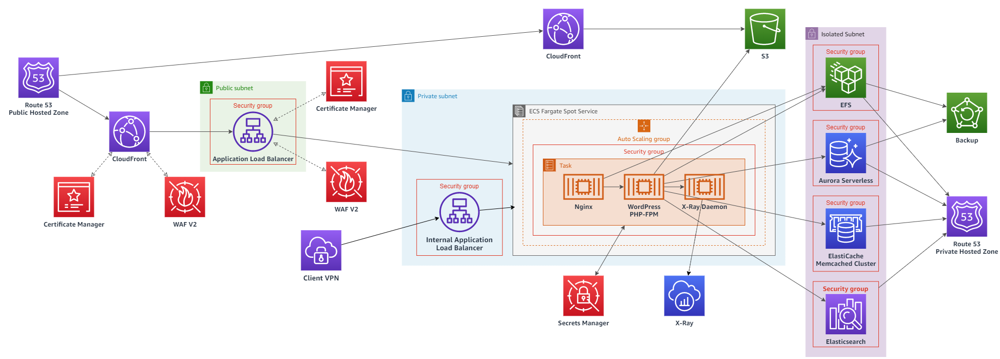

# AWS Serverless WordPress

`[2020/11/03] Still working on the documentation`

## Introduction
Please read the blog post for introduction and explanation.
[Dev.to: Best Practices for Running WordPress on AWS using CDK](https://dev.to/mikletng/best-practices-for-running-wordpress-on-aws-using-cdk-aj9)

### WordPress Plugin Used
- W3 Total Cache
- WP Offload SES Lite
- WP Offload Media Lite
- ElasticPress
- Multiple Domain
- HumanMade - AWS-XRay (Working on making it work...)

## Architecture Diagram


## Deployment - (To be update)
### Before getting started
Please make sure you have/are
- Using bash
- Node.js installed
- NPM and Yarn installed
- Installed and running Docker
- Installed and configured AWS CLI
- Installed the latest version of AWS CDK CLI

*Please be notice, this stack only can deploy into us-east-1*
0. You should have a public hosted zone in Route 53
1. Initialize the CDK project, run `make init`
2. Deploy the CDK Toolkit stack on to the target region, run `npx bootstrap aws://AWS_ACCOUNT_ID/AWS_REGION --profile AWS_PROFILE_NAME`
3. Copy the `config.sample.toml` and rename to `config.toml`
4. Modify the configuration in `config.toml`
    ```toml
   [environment]
   account = "YOUR_AWS_ACCOUNT_ID" # Your AWS account ID
   
   [admin]
   allowIpAddresses = ["0.0.0.0/0"] #Your public IPv4 address
   
   #Both certificate ARN should create and get through Makefile
   serverCertificateArn = "arn:aws:acm:us-east-1:YOUR_AWS_ACCOUNT_ID:certificate/xxxxxxxxxxxxxxxxxxxxxxxx"
   clientCertificateArn = "arn:aws:acm:us-east-1:YOUR_AWS_ACCOUNT_ID:certificate/yyyyyyyyyyyyyyyyyyyyyyyy"
   
   [database]
   username = "wordpress" #Database username
   defaultDatabaseName = "wordpress" #Default database name
   
   [domain]
   domainName = "example.com" #Your root domain name, useually is the domain name of the created public hosted zone in Route 53
   hostname = "blog.example.com" #Your desire hostname for the WordPress
   alternativeHostname = ["*.blog.example.com"]
   
   [contact]
   email = ["hello@blog.example.com"] #Email address for notify any in-compliance event in AWS Config
    ```
7. Run `make deploy profile=YOUR_AWS_PROFILE_NAME`
8. After the CloudFormation stack deployed, open the Session Manager in System Manager, and open a session to the created bastion host. Then run the following command. (The version of WordPress plugin may NOT be latest)
    ```shell script
    sudo su -
    cd /mnt/efs/wp-content/plugins &&\
    curl -O https://downloads.wordpress.org/plugin/w3-total-cache.0.15.1.zip &&\
    curl -O https://downloads.wordpress.org/plugin/wp-ses.1.4.3.zip &&\
    curl -O https://downloads.wordpress.org/plugin/amazon-s3-and-cloudfront.2.4.4.zip &&\
    curl -O https://downloads.wordpress.org/plugin/elasticpress.zip &&\
    curl -O https://downloads.wordpress.org/plugin/multiple-domain.zip &&\
    curl https://codeload.github.com/humanmade/aws-xray/zip/1.2.12 -o humanmade-aws-xray-1.2.12.zip &&\
    unzip '*.zip' &&\
    rm -rf *.zip
    ```
9. After the installation, go to the webpage and setup the database connection and plugin configuration. For the hostname of Memcached or MySQL, please check the output in CloudFormation stack.

## References
https://aws.amazon.com/tw/blogs/devops/build-a-continuous-delivery-pipeline-for-your-container-images-with-amazon-ecr-as-source/
https://docs.aws.amazon.com/AWSCloudFormation/latest/UserGuide/blue-green.html

https://docs.aws.amazon.com/codepipeline/latest/userguide/tutorials-ecs-ecr-codedeploy.html#tutorials-ecs-ecr-codedeploy-cluster
https://docs.aws.amazon.com/AmazonECS/latest/developerguide/task-networking.html
https://stackoverflow.com/questions/56535632/how-do-i-link-2-containers-running-in-a-aws-ecs-task

https://github.com/Monogramm/docker-wordpress
https://github.com/fjudith/docker-wordpress
https://github.com/humanmade/aws-xray

https://pecl.php.net/package/memcached
https://pecl.php.net/package/APCu

https://stackoverflow.com/questions/54772120/docker-links-with-awsvpc-network-mode

https://www.mgt-commerce.com/blog/aws-varnish-auto-scaling-magento/

https://downloads.wordpress.org/plugin/w3-total-cache.0.15.1.zip
https://downloads.wordpress.org/plugin/wp-ses.1.4.3.zip
https://downloads.wordpress.org/plugin/amazon-s3-and-cloudfront.2.4.4.zip
https://downloads.wordpress.org/plugin/elasticpress.zip